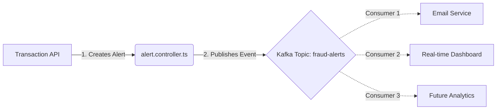

# Kafka in Sahayak PFMS: How & Why?

## 1. Why are we using Kafka?
We use Apache Kafka to build an **Event-Driven Architecture**. This solves three critical problems:

### A. 🚀 Decoupling (The "Fire and Forget" Principle)
*   **Without Kafka:** The API Gateway would have to manually call the SMS Service, then the Email Service, then the Dashboard Service. If one fails or is slow, the entire transaction is blocked.
*   **With Kafka:** The API Gateway just "shouts" once: *"New Fraud Alert Created!"* (publishes an event). It doesn't care who is listening. It immediately responds to the user.

### B. 📈 Scalability
*   We can add new features without touching the core code.
*   *Want to add a new "Police Notification System"?* Just write a service that listens to the `fraud-alerts` topic. You don't need to modify the API Gateway or restart the main server.

### C. 🛡️ Reliability & Buffering
*   If the "Email Service" goes down, Kafka **stores the messages**.
*   When the service comes back online, it reads all the missed alerts and sends the emails. No data is lost.

---

## 2. How is it Implemented?

### The Architecture


### The Code Flow (`api-gateway`)

1.  **Producer Setup**: The API Gateway connects to the Kafka Broker on startup.
2.  **Trigger Point**: Inside `src/controllers/alert.controller.ts`, when a high-risk transaction is detected:
    ```typescript
    // Real code snippet logic
    if (riskScore > 70) {
       // 1. Save to MongoDB
       const alert = await Alert.create(...);

       // 2. Publish to Kafka
       await producer.send({
           topic: 'fraud-alerts',
           messages: [{
               value: JSON.stringify({
                   alertId: alert.id,
                   riskScore: 85,
                   vendor: "ABC Corp"
               })
           }]
       });
    }
    ```
3.  **Fail-Safe**: If Kafka is down, the code catches the error and logs it, but **does not crash**. The transaction is still processed locally.

### Key Configuration
*   **Topic Name**: `fraud-alerts`
*   **Broker Port**: `9092` (External), `29092` (Docker Internal)
*   **Library**: `kafkajs` (Node.js)
